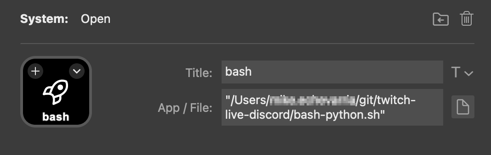

# twitch-live-discord

Python script to authenticate against the [Twitch API](https://dev.twitch.tv/docs/api/), get live user details and then post a rich text message to a channel in [Discord](https://discord.com/developers/docs/reference). The reason I built this instead of using a bot is that most bots do not add a random number to the preview URL, resulting in a [cached image in Discord](https://discuss.dev.twitch.tv/t/feature-request-one-small-change-that-could-fix-the-discord-webhook-embed-cached-image-issues/27477)

## Setup

* Register an application with [Twitch](https://dev.twitch.tv/). Note the `Client ID` and `Client Secret`


* Create a [Webhook](https://support.discord.com/hc/en-us/articles/228383668-Intro-to-Webhooks) in Discord. Note the `Webhook URL`


* Make sure [python](https://www.python.org/) and [python-dotenv](https://github.com/theskumar/python-dotenv) are installed

``` bash
brew install python
/opt/homebrew/bin/python3 -m pip install --break-system-packages python-dotenv requests
```

* Create a `.env` file in the root directory to put the follow variables

```properties
TWITCH_USER="twitch_streamer_name"
CLIENT_ID="<your twitch app client id"
CLIENT_SECRET="<your twitch dev secret>"
WEBHOOK_URL="https://discord.com/api/webhooks/<REST OF THE URL>
```

## Execute the script

* Run the script to with the following command.

```bash
python3 script.py
```

* Example output in Discord


## StreamDeck Integration

* To launch with [StreamDeck](https://www.elgato.com/us/en/s/welcome-to-stream-deck) Use the **System** -> **Open** option
### Windows
* If you are using [Windows Subsystem for Linux](https://learn.microsoft.com/en-us/windows/wsl/install) you can launch with this command 
```bash
wsl.exe "/usr/bin/python3" "/home/user/git/twitch-live-discord/script.py"
```

### Mac
* StreamDeck will only open `.sh` files so select `bash-python.sh`
> you will need to edit the hardcoded path to `script.py` inside this file to match your system

