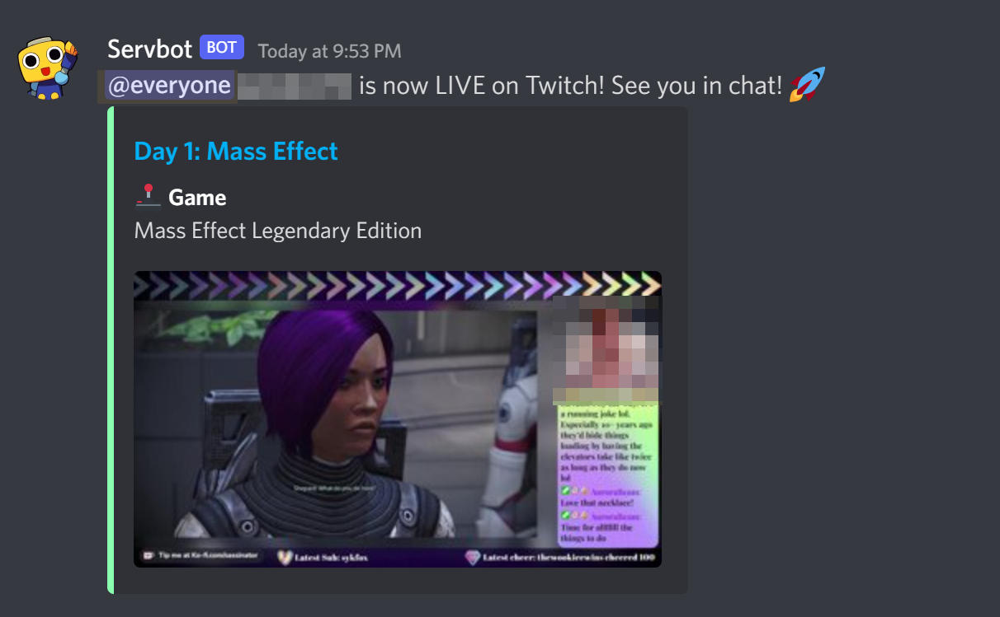

# twitch-live-discord

Python script to authenticate against the [Twitch API](https://dev.twitch.tv/docs/api/), get live user details and then post a rich text message to a channel in [Discord](https://discord.com/developers/docs/reference)

## Setup
* Register an application with [Twitch](https://dev.twitch.tv/). Note the `Client ID` and `Client Secret`


* Create a [Webhook](https://support.discord.com/hc/en-us/articles/228383668-Intro-to-Webhooks) in Discord. Note the `Webhook URL`


* Make sure [python-dotenv](https://github.com/theskumar/python-dotenv) is installed
``` bash
sudo apt -y install python3-pip
pip install python-dotenv
```

* Create a `.env` file in the root directory to put the follow variables

```properties
DELAY=0
TWITCH_USER="twitch_streamer_name"
CLIENT_ID="<your twitch app client id"
CLIENT_SECRET="<your twitch dev secret>"
WEBHOOK_URL="https://discord.com/api/webhooks/<REST OF THE URL>
```

## Execute the script

* Run the script to with the following command. The `DELAY` property can be used to wait a little bit after you go live to post the message
```bash
python3 script.py
```

* Example output in Discord
